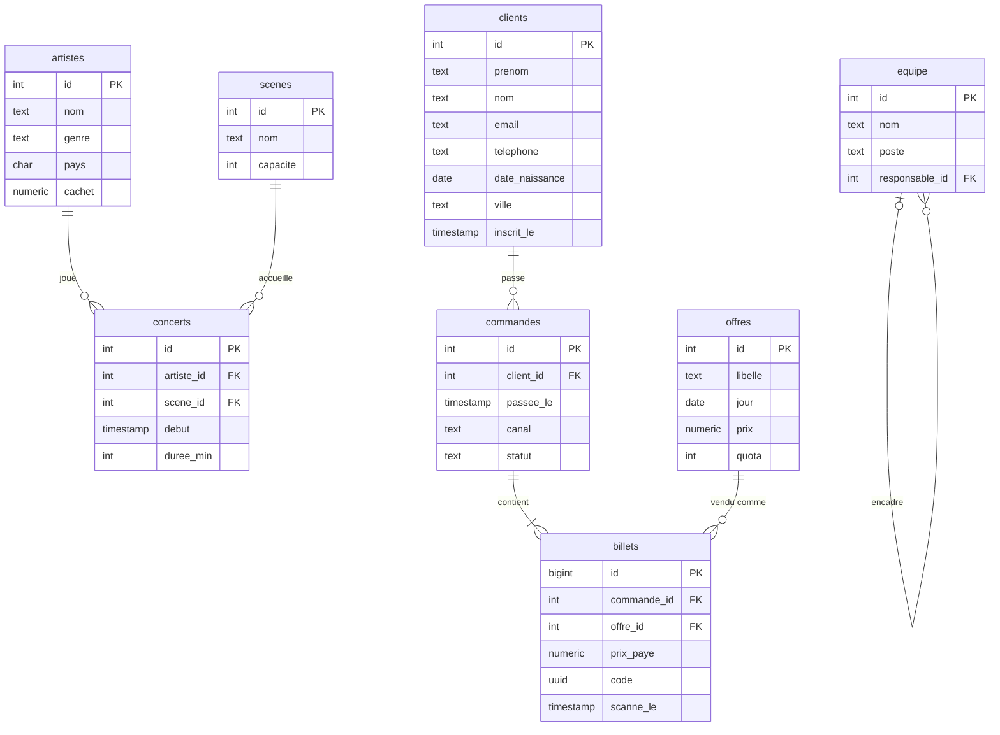

# Festival Contre-Temps : la base de démonstration

Trois jours de concerts, les 10, 11 et 12 juillet 2026. Quatre scènes, 36 artistes, et une billetterie ouverte depuis le 15 janvier. Toutes les notions du module se travaillent sur cette base avant d'être appliquées à votre projet.

---

## Lancer la base

Il faut Docker. Depuis ce dossier :

```bash
docker compose up -d
```

Au premier démarrage, PostgreSQL crée les tables puis génère les données : comptez une à deux minutes. Suivez l'avancement avec :

```bash
docker compose logs -f db
```

C'est prêt quand la ligne `PostgreSQL init process complete` apparaît.

### Se connecter

En ligne de commande :

```bash
docker compose exec db psql -U festival -d festival
```

Avec un client graphique (DBeaver, pgAdmin, l'extension PostgreSQL de VS Code) :

| Paramètre | Valeur |
|---|---|
| Hôte | `localhost` |
| Port | `5432` |
| Base | `festival` |
| Utilisateur | `festival` |
| Mot de passe | `festival` |

### Vérifier le chargement

```bash
docker compose exec db psql -U festival -d festival -f /verifier.sql
```

Vous devez obtenir exactement 150 000 clients, 220 000 commandes et 408 325 billets. Les données sont tirées au hasard, mais avec une graine fixe : tout le monde a la même base.

### En cas de souci

| Symptôme | Cause et solution |
|---|---|
| `port is already allocated` | un autre PostgreSQL occupe le port 5432. Lancez `PORT_FESTIVAL=5433 docker compose up -d` (dans PowerShell : `$env:PORT_FESTIVAL=5433; docker compose up -d`) et connectez-vous sur le port 5433 |
| Les tables sont vides ou incomplètes | le chargement a été interrompu. Repartez de zéro (ci-dessous) |
| Vous avez tout cassé | repartez de zéro (ci-dessous) |

Repartir de zéro efface la base et la régénère :

```bash
docker compose down -v
docker compose up -d
```

---

## Le schéma



| Table | Lignes | Ce qu'elle contient |
|---|---|---|
| `artistes` | 36 | nom, genre, pays, cachet en euros |
| `scenes` | 4 | de la Grande Scène (20 000 places) au Club (1 200) |
| `concerts` | 36 | un concert par artiste ; les cachets les plus élevés jouent à 22 h sur la Grande Scène |
| `offres` | 9 | pass 1 jour, pass 3 jours, Early, VIP. `jour` vide = valable les trois jours. `quota` = places mises en vente |
| `clients` | 150 000 | identité, e-mail, téléphone, date de naissance, ville. Un quart n'a jamais rien acheté ; environ 15 000 habitués reviennent souvent |
| `commandes` | 220 000 | date, canal (`web`, `appli`, `guichet`), statut (`payee`, `remboursee`) |
| `billets` | 408 325 | de 1 à 4 par commande, prix réellement payé, code unique, heure de passage à l'entrée (`scanne_le`, vide si le billet n'a pas servi) |
| `equipe` | 24 | l'organigramme : chaque membre pointe vers son responsable |

## Ce qu'il faut savoir sur les données

- **Trois vagues de ventes** : la ruée de l'ouverture le 15 janvier, l'annonce de la programmation le 3 mars, puis une montée régulière jusqu'au festival.
- **Le Pass Early** ne s'est vendu que jusqu'au 15 février.
- **Environ 5 % des billets** ont été payés avec un code promo de 10 % : `prix_paye` peut donc être inférieur au prix de l'offre.
- **Le guichet** n'a vendu que pendant le festival.
- **Environ 3 % des commandes** ont été remboursées. Leurs billets existent encore mais n'ont jamais été scannés.
- **Les données personnelles sont fictives**, mais elles ressemblent à des vraies : e-mail, téléphone, date de naissance. On s'en sert pour parler de droits d'accès.
